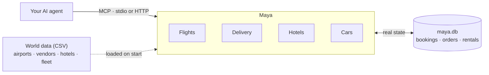

<h1 align="center">Maya</h1>

<p align="center">
  <em>An API simulator.<br/>
  A SimCity.<br/>
  The Matrix — for AI agents.</em>
</p>

## Overview

Maya is an API simulator for AI agents: a fictional world of everyday
services — flights, hotels, car rental and food delivery — exposed as MCP
tools and running locally. Four domains exist today:

- **Flights** — search, book, retrieve and cancel flights on a fictional
  airline network, direct or with one stop. Seats deplete for real, fares
  move with time and demand.
  See [`src/maya/simulations/flights/README.md`](src/maya/simulations/flights/README.md)
  for what's not obvious from the tool descriptions alone.
- **Delivery** — browse vendors and menus, place and cancel food delivery
  orders within Aira, the capital. See
  [`src/maya/simulations/delivery/README.md`](src/maya/simulations/delivery/README.md)
  for the same — in particular, delivery addresses are zones, not street
  addresses.
- **Hotels** — search, book, retrieve and cancel hotel rooms in Aira. Rooms
  sell per night and prices rise as a night approaches. See
  [`src/maya/simulations/hotels/README.md`](src/maya/simulations/hotels/README.md).
- **Cars** — rent a car from the one desk at Aira International, same-day
  included. See
  [`src/maya/simulations/cars/README.md`](src/maya/simulations/cars/README.md).

Each domain has its own bookings/orders that persist across restarts
(SQLite) — so failures (sold-out flights or rooms, non-refundable fares,
cancellation windows, undeliverable zones) are real rules to discover, not canned
responses.



## Install

```bash
git clone https://github.com/<you>/maya.git
cd maya
uv sync
```

Or run it straight from GitHub without cloning:

```bash
uvx --from git+https://github.com/shvinn/maya maya serve --domain all
```

Bookings, orders and rentals are kept in `maya.db` — at the repo root when
running from a clone, otherwise in the folder you start the server from. Set
`MAYA_DB_PATH` to put it somewhere else.

## Usage

Each domain is its own MCP server. Run one over HTTP:

```bash
uv run maya serve                     # flights, MCP over streamable HTTP on :6292
uv run maya serve --domain delivery   # delivery, same, :6292
uv run maya serve --domain hotels     # hotels, same, :6292
uv run maya serve --domain cars       # car rental, same, :6292
uv run maya serve --domain all        # all at once, one port, one path each:
                                       #   http://localhost:6292/flights/mcp
                                       #   http://localhost:6292/delivery/mcp
                                       #   http://localhost:6292/hotels/mcp
                                       #   http://localhost:6292/cars/mcp
```

Or as stdio servers, e.g. for Claude Desktop / Claude Code:

```json
{
  "mcpServers": {
    "maya-flights": { "command": "uv", "args": ["run", "maya", "mcp", "flights"] },
    "maya-delivery": { "command": "uv", "args": ["run", "maya", "mcp", "delivery"] },
    "maya-hotels": { "command": "uv", "args": ["run", "maya", "mcp", "hotels"] },
    "maya-cars": { "command": "uv", "args": ["run", "maya", "mcp", "cars"] }
  }
}
```

MCP is the only interface today — no REST/OpenAPI yet.

## Run with Docker

No clone or Python needed. One image serves every domain:

```bash
docker run -p 127.0.0.1:6292:6292 -v maya-data:/data ghcr.io/shvinn/maya
                                       # all domains, one path each:
                                       #   http://localhost:6292/flights/mcp
                                       #   http://localhost:6292/delivery/mcp
                                       #   http://localhost:6292/hotels/mcp
                                       #   http://localhost:6292/cars/mcp
docker run -p 127.0.0.1:6292:6292 -v maya-data:/data ghcr.io/shvinn/maya serve --domain hotels
docker compose up                      # same as the first, from a clone
```

Or as stdio servers for an MCP client config:

```json
{
  "mcpServers": {
    "maya-flights": {
      "command": "docker",
      "args": ["run", "-i", "--rm", "-v", "maya-data:/data", "ghcr.io/shvinn/maya", "mcp", "flights"]
    }
  }
}
```

- Bookings, orders and rentals live in the `maya-data` volume, so they
  survive restarts and are shared by every container using it. Remove the
  volume (`docker volume rm maya-data`) for a fresh world.
- Publish the port on `127.0.0.1` as above: the server has no
  authentication.
- Images are built for `linux/amd64` and `linux/arm64`, which covers Linux,
  macOS (Intel and Apple Silicon) and Windows (x64 and ARM, via Docker
  Desktop's default Linux containers).

## Contributing

See [CONTRIBUTING.md](CONTRIBUTING.md).

## License

MIT. See [LICENSE](LICENSE).
