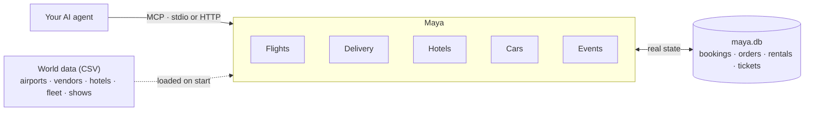

<h1 align="center">Maya</h1>

<p align="center">
  <em>An API simulator.<br/>
  A SimCity.<br/>
  The Matrix — for AI agents.</em>
</p>

## Overview

Maya is an API simulator for AI agents: a fictional world of everyday
services — flights, hotels, car rental, food delivery and events — exposed as MCP
tools and running locally. Five domains exist today:

- **Flights** — search, book, retrieve and cancel flights on a fictional
  airline network, direct or with one stop. Seats deplete for real, fares
  move with time and demand.
  See [`src/maya/simulations/flights/README.md`](src/maya/simulations/flights/README.md)
  for what's not obvious from the tool descriptions alone.
- **Delivery** — browse vendors and menus, place and cancel food delivery
  orders within Aira, the capital. See
  [`src/maya/simulations/delivery/README.md`](src/maya/simulations/delivery/README.md)
  for the same — in particular, delivery addresses are zones, not street
  addresses.
- **Hotels** — search, book, retrieve and cancel hotel rooms in Aira. Rooms
  sell per night and prices rise as a night approaches. See
  [`src/maya/simulations/hotels/README.md`](src/maya/simulations/hotels/README.md).
- **Cars** — rent a car from the one desk at Aira International, same-day
  included. See
  [`src/maya/simulations/cars/README.md`](src/maya/simulations/cars/README.md).
- **Events** — comedy, concerts, lectures, theatre, family shows, films and
  workshops at venues across Aira. Popular shows sell out; some are 18+. See
  [`src/maya/simulations/events/README.md`](src/maya/simulations/events/README.md).

Each domain has its own bookings/orders that persist across restarts
(SQLite) — so failures (sold-out flights or rooms, non-refundable fares,
cancellation windows, undeliverable zones) are real rules to discover, not canned
responses.



## Install

```bash
git clone https://github.com/<you>/maya.git
cd maya
uv sync
```

Or run it straight from GitHub without cloning:

```bash
uvx --from git+https://github.com/shvinn/maya maya serve --domain all
```

Bookings, orders and rentals are kept in `maya.db` — at the repo root when
running from a clone, otherwise in your user data folder
(`~/Library/Application Support/maya` on macOS, `~/.local/share/maya` on
Linux, `%LOCALAPPDATA%\maya` on Windows). Set `MAYA_DB_PATH` to put it
somewhere else.

## Usage

Each domain is its own MCP server. Run one over HTTP:

```bash
uv run maya serve                     # flights, MCP over streamable HTTP on :6292
uv run maya serve --domain delivery   # delivery, same, :6292
uv run maya serve --domain hotels     # hotels, same, :6292
uv run maya serve --domain cars       # car rental, same, :6292
uv run maya serve --domain events     # events, same, :6292
uv run maya serve --domain world      # world clock controls, same, :6292
uv run maya serve --domain all        # all at once, one port, one path each:
                                       #   http://localhost:6292/flights/mcp
                                       #   http://localhost:6292/delivery/mcp
                                       #   http://localhost:6292/hotels/mcp
                                       #   http://localhost:6292/cars/mcp
                                       #   http://localhost:6292/events/mcp
                                       #   http://localhost:6292/world/mcp
```

To hook Maya up to Claude Desktop, Claude Code, Cursor or another MCP client,
see [Connect an MCP client](#connect-an-mcp-client).

MCP is the only interface today — no REST/OpenAPI yet.

### Refusals and references

When a rule says no — sold out, not refundable, too late to cancel — the tool
call comes back as an **MCP tool error** (`isError: true`), with the details
structured as `{"error": {"code", "message", "hint"}}`. `code` is stable and
machine-readable (`sold_out`, `too_late_to_cancel`, ...); `hint` says honestly
whether retrying can help. A client that only checks the error flag can't
mistake a refused booking for a confirmed one.

Every booking, rental, ticket purchase and order — and its cancellation —
carries a `reference` field, the same key in every domain. (Each domain's
own name for it, such as `booking_reference`, `rental_reference` or
`order_id`, is still there too.) Bookings are atomic: two agents racing for
the last seat can't both get it.

## Maya time

Maya runs on its own clock: **Mayan Meridian Time (MYT), a fixed UTC−08:00**
with no daylight saving. Every deadline, status and price uses it, so Maya
agrees on "now" whether it runs on your laptop, in Docker or in CI.

By default Maya time follows real time 1:1. To test something that takes
hours or days — a delivery arriving, a check-out, a show ending — speed it up
or skip ahead instead of waiting:

| Tool (on the `world` server) | Effect |
| --- | --- |
| `world_get_time` | What time it is in Maya (also on every domain server) |
| `world_set_time_scale(scale)` | `1` real time, `60` one Maya hour per real minute, `1440` a Maya day per minute, `0` frozen |
| `world_advance_time(minutes, hours, days)` | Skip ahead instantly — forward only |
| `world_reset_time` | Back to real time at 1:1 |

At scale 60, a 45-minute delivery arrives in 45 real seconds. Set a scale at
startup with `MAYA_TIME_SCALE=60` (works in Docker too). The controls live on
their own `world` server (`maya mcp world`, `/world/mcp`) so the agent you're
testing — connected to a domain server — can read the time but can't skip
past its own deadlines.

The clock is saved in `maya.db` with the bookings, so Maya time carries on
across restarts — and keeps running against real time while the server is
stopped. Freeze it first (scale `0`) if you want to pick up exactly where
you left off.

## Run with Docker

No clone or Python needed. One image serves every domain:

```bash
docker run -p 127.0.0.1:6292:6292 -v maya-data:/data ghcr.io/shvinn/maya
                                       # all domains, one path each:
                                       #   http://localhost:6292/flights/mcp
                                       #   http://localhost:6292/delivery/mcp
                                       #   http://localhost:6292/hotels/mcp
                                       #   http://localhost:6292/cars/mcp
                                       #   http://localhost:6292/events/mcp
                                       #   http://localhost:6292/world/mcp
docker run -p 127.0.0.1:6292:6292 -v maya-data:/data ghcr.io/shvinn/maya serve --domain hotels
docker compose up                      # same as the first, from a clone
```

- Bookings, orders and rentals live in the `maya-data` volume, so they
  survive restarts and are shared by every container using it. Remove the
  volume (`docker volume rm maya-data`) for a fresh world.
- Publish the port on `127.0.0.1` as above: the server has no
  authentication.
- Images are built for `linux/amd64` and `linux/arm64`, which covers Linux,
  macOS (Intel and Apple Silicon) and Windows (x64 and ARM, via Docker
  Desktop's default Linux containers).

## Connect an MCP client

Pick one of three setups. Each gives you six servers: `flights`, `delivery`,
`hotels`, `cars`, `events` and `world`. Give the agent you're testing the
domain servers; keep `world` (the clock controls) for yourself, so the agent
can't skip past its own deadlines.

### 1. Local, from a clone (stdio)

The client starts Maya itself. `--directory` points `uv` at your clone, since
MCP clients don't start servers from inside it.

```json
{
  "mcpServers": {
    "maya-flights": { "command": "uv", "args": ["run", "--directory", "/path/to/maya", "maya", "mcp", "flights"] },
    "maya-delivery": { "command": "uv", "args": ["run", "--directory", "/path/to/maya", "maya", "mcp", "delivery"] },
    "maya-hotels": { "command": "uv", "args": ["run", "--directory", "/path/to/maya", "maya", "mcp", "hotels"] },
    "maya-cars": { "command": "uv", "args": ["run", "--directory", "/path/to/maya", "maya", "mcp", "cars"] },
    "maya-events": { "command": "uv", "args": ["run", "--directory", "/path/to/maya", "maya", "mcp", "events"] },
    "maya-world": { "command": "uv", "args": ["run", "--directory", "/path/to/maya", "maya", "mcp", "world"] }
  }
}
```

No clone? Swap `uv run --directory /path/to/maya` for
`uvx --from git+https://github.com/shvinn/maya`, and add
`"env": {"MAYA_DB_PATH": "/path/to/maya.db"}` if you want the bookings
somewhere other than your user data folder. `uvx` caches what it installs;
add `--refresh` once to pick up a newer Maya.

### 2. Docker, no clone (stdio)

Each client session starts a short-lived container; all of them share the
`maya-data` volume, so they share one world.

```json
{
  "mcpServers": {
    "maya-flights": { "command": "docker", "args": ["run", "-i", "--rm", "-v", "maya-data:/data", "ghcr.io/shvinn/maya", "mcp", "flights"] },
    "maya-delivery": { "command": "docker", "args": ["run", "-i", "--rm", "-v", "maya-data:/data", "ghcr.io/shvinn/maya", "mcp", "delivery"] },
    "maya-hotels": { "command": "docker", "args": ["run", "-i", "--rm", "-v", "maya-data:/data", "ghcr.io/shvinn/maya", "mcp", "hotels"] },
    "maya-cars": { "command": "docker", "args": ["run", "-i", "--rm", "-v", "maya-data:/data", "ghcr.io/shvinn/maya", "mcp", "cars"] },
    "maya-events": { "command": "docker", "args": ["run", "-i", "--rm", "-v", "maya-data:/data", "ghcr.io/shvinn/maya", "mcp", "events"] },
    "maya-world": { "command": "docker", "args": ["run", "-i", "--rm", "-v", "maya-data:/data", "ghcr.io/shvinn/maya", "mcp", "world"] }
  }
}
```

### 3. Docker or a remote server (HTTP)

Start one server for every domain — `docker run -p 127.0.0.1:6292:6292 -v
maya-data:/data ghcr.io/shvinn/maya`, `docker compose up`, or
`uv run maya serve --domain all` — and point the client at its URLs. The
config format varies by client; for example, Claude Code:

```bash
claude mcp add --transport http maya-flights http://localhost:6292/flights/mcp
claude mcp add --transport http maya-delivery http://localhost:6292/delivery/mcp
claude mcp add --transport http maya-hotels http://localhost:6292/hotels/mcp
claude mcp add --transport http maya-cars http://localhost:6292/cars/mcp
claude mcp add --transport http maya-events http://localhost:6292/events/mcp
claude mcp add --transport http maya-world http://localhost:6292/world/mcp
```

or a project's `.mcp.json`:

```json
{
  "mcpServers": {
    "maya-flights": { "type": "http", "url": "http://localhost:6292/flights/mcp" },
    "maya-delivery": { "type": "http", "url": "http://localhost:6292/delivery/mcp" },
    "maya-hotels": { "type": "http", "url": "http://localhost:6292/hotels/mcp" },
    "maya-cars": { "type": "http", "url": "http://localhost:6292/cars/mcp" },
    "maya-events": { "type": "http", "url": "http://localhost:6292/events/mcp" },
    "maya-world": { "type": "http", "url": "http://localhost:6292/world/mcp" }
  }
}
```

Clients that only speak stdio can bridge to a URL with `npx mcp-remote <url>`.
On another machine, replace `localhost` with its address — but Maya has no
authentication and everyone connected shares one world, so keep it on a
private network or behind a VPN, never on the open internet.

## Contributing

See [CONTRIBUTING.md](CONTRIBUTING.md).

## License

MIT. See [LICENSE](LICENSE).
